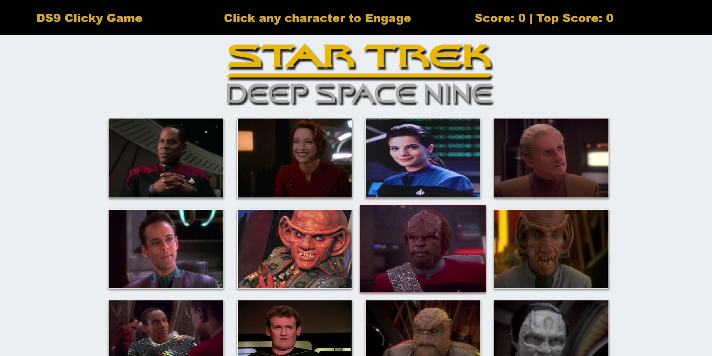

# DS9-Clicky

## Description  
DS9 Clicky is a Star Trek memory game created with React.  
To play, try and click every Star Trek Deep Space 9 character once and only once.  
Win by clicking all 12 or lose by clicking the same character more than once.
***

***
## Libraries
   * [React](https://reactjs.org/)
   * [Bootstrap](https://getbootstrap.com/)

***
## **Give it a try**
* ### [Try it here!](http://travishill1.github.io/DS9-Clicky)
